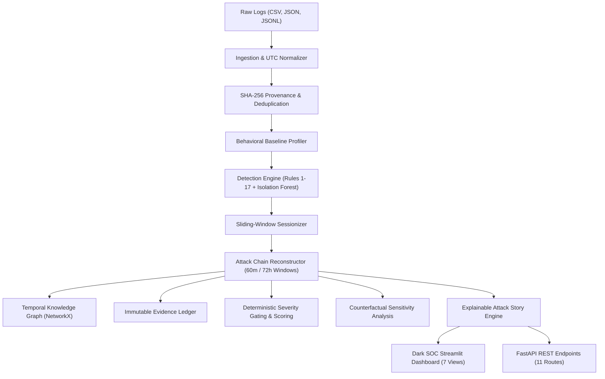

# SentinelGraph AI — Comprehensive Technical Architecture & System Report

> **Problem Code:** HNX26PSI03 — AI-Powered Cyber Threat Intelligence  
> **Tagline:** *"From Millions of Logs to One Explainable Attack Story."*  
> **Repository:** `https://github.com/kaelon-dev/Sentinel-Graph-AI.git`  
> **Execution Mode:** 100% Local, Offline, Deterministic, Air-Gapped  

---

## 1. Executive Summary

Enterprise security operations centers (SOCs) are overwhelmed by alert fatigue. Modern organizations collect tens of millions of raw log events daily from authentications, file access, processes, and network egress. Traditional SIEMs (Security Information and Event Management) evaluate logs in isolation: an abnormal login creates Alert #1, opening a payroll file creates Alert #2, and plugging in a USB creates Alert #3. This **Event $\rightarrow$ Alert** architecture forces human analysts to manually connect disparate dots while drowning in noise.

**SentinelGraph AI** inverts this paradigm into an **Events $\rightarrow$ Graph $\rightarrow$ Story Engine**. Instead of treating logs independently, the engine:
1. Normalizes heterogenous logs into a unified, cryptographically hashed format.
2. Learns an enterprise behavioral baseline (who normally logs in from where, what devices they touch, and what USBs are approved).
3. Connects events across users, endpoints, IPs, applications, and peripherals into a directed temporal knowledge graph.
4. Reconstructs multi-stage MITRE ATT&CK chains into **one single explainable Attack Story** with verified evidence proofs, zero false alarms on clean logs, and counterfactual sensitivity analysis.



---

## 2. End-to-End Pipeline Breakdown

The SentinelGraph AI pipeline executes deterministically through 10 core architectural modules in `sentinelgraph/`:

### 2.1 Ingestion, Normalization & Integrity (`sentinelgraph/ingestion/`)
* **`parsers.py` (`LogParser`):** Format-agnostic ingestion supporting CSV, JSON, and JSON-Lines (JSONL). Automatically maps disparate field naming conventions (e.g., `user`, `username`, `src_user` $\rightarrow$ `user_id`).
* **`normalizer.py` (`EventNormalizer`):** Enforces strict UTC ISO-8601 timestamps (`tzinfo=timezone.utc`), eliminating timezone drift, local machine skews, and daylight savings offsets.
* **`integrity.py` (`IntegrityVerifier`):** Computes a deterministic SHA-256 hash for every raw input file and a per-event fingerprint:
  $$\text{Fingerprint} = \text{SHA256}(\text{timestamp} \parallel \text{event\_type} \parallel \text{user\_id} \parallel \text{device\_id} \parallel \text{payload})$$
  This guarantees that log telemetry cannot be tampered with or modified after ingestion.

### 2.2 Behavioral Baseline Profiling (`sentinelgraph/baseline/`)
* **`profiler.py` (`BaselineProfiler`):** Builds historical entity profile models:
  * Known user IP addresses, countries, and login hour distributions.
  * Known device hostnames and assigned users.
  * Corporate hardware inventory whitelists (`approved_usbs`).
  * Normal file access paths and document sensitivity levels.
* **Baseline Maturity Grading:** Classifies entity baselines into 4 maturity levels (`INSUFFICIENT`, `WEAK`, `MODERATE`, `STRONG`). When a baseline is weak or newly observed, the engine downweights anomaly scores rather than panicking, directly suppressing false positives.

### 2.3 Detection Engine (`sentinelgraph/detection/`)
* **`rules.py` (`DetectionEngine`):** 17 deterministic rules aligned with the MITRE ATT&CK framework:
  * `RULE_01` / `RULE_02`: Unfamiliar IP / Unfamiliar Country (T1078 Valid Accounts).
  * `RULE_03`: Off-Hours Activity (T1078).
  * `RULE_04`: Novel Device Login (T1078).
  * `RULE_05`: Repeated Failed Logins / Password Spraying (T1110 Brute Force).
  * `RULE_06` / `RULE_07`: First-Time Sensitive File Access (T1005 Data from Local System).
  * `RULE_08`: Rapid Multi-File Access / Directory Enumeration (T1083 File Discovery).
  * `RULE_09`: Unapproved USB Device Connection (T1200 Hardware Additions).
  * `RULE_10`: Sensitive File Copied to Removable Media (T1052.001 Exfiltration via Physical Medium).
  * `RULE_11` / `RULE_12`: High-Volume Network Egress to Unfamiliar External IP (T1041 Exfiltration over C2).
  * `RULE_13`–`RULE_17`: Process execution anomalies, impossible travel, and privilege escalation.
* **`anomaly_ml.py` (`MLAnomalyDetector`):** Optional, fully offline, unsupervised `IsolationForest` model that detects multi-dimensional numerical outliers (byte spikes, abnormal timing) as supplementary signals without requiring cloud access.
* **`scoring.py` (`ScoringEngine`):** Implements **Score Deduplication** to prevent geographic penalties from compounding, and enforces **Severity Gating**.

### 2.4 Sessionization & Correlation (`sentinelgraph/correlation/`)
* **`sessionization.py` (`Sessionizer`):** Reconstructs atomic events into temporal sessions using a 30-minute inactivity gap threshold per `(user_id, device_id)` pair.
* **`attack_chain.py` (`AttackChainReconstructor`):**
  * **Dual Correlation Windows:** Employs a 60-minute standard correlation window for rapid attacks, and a **4,320-minute (72-hour) extended correlation window** with temporal decay for slow-burn attacks.
  * **Entity Pivot Clustering:** Groups events that share entity continuity (`user`, `device`, `file`, `usb`, `destination`).
  * **Boundary Partitioning:** Prevents "Graph Bleed" by keeping unrelated users and endpoints cleanly separated.

### 2.5 Temporal Graph Engine (`sentinelgraph/graph/`)
* **`entity_graph.py` (`GraphEngine`):** Utilizes NetworkX (`nx.DiGraph`) to build heterogeneous directed graphs:
  * **Nodes:** Users, Devices, IPs, Countries, Applications, Files, USBs, Events.
  * **Edges:** `logged_in_from`, `used_device`, `executed`, `accessed`, `connected_to`, `copied_to`, `transferred_to`.
  * **Temporal Edges:** `occurred_before`, annotated with exact elapsed seconds ($\Delta t$) between consecutive steps.

### 2.6 Forensic Narrative & Evidence Generation (`sentinelgraph/reporting/`)
* **`explanations.py` (`NarrativeExplainer`):** Constructs plain-English, evidence-grounded narratives explaining:
  * **What Happened:** Detailed chronological reconstruction.
  * **Why It Matters:** Business risk, regulatory impact, data classifications involved.
  * **Why This Event Belongs:** Entity pivot rationale per event.
  * **Alternative Explanations & Uncertainties:** Considers legitimate business travel or emergency administrative operations.
* **Counterfactual Sensitivity:** Mathematically measures what the risk score would be if each piece of evidence were removed, proving which event is the "smoking gun."

---

## 3. Walkthrough of the Primary Attack Story

To understand how the program works in practice, consider the primary demo scenario (`data_exfiltration_attack_logs.csv`):

```
09:15:00 UTC ──► User U102 logs into DEV-17 from Singapore (203.0.113.77) [EVT-1034]
                       │ (10 minutes dwell)
09:25:00 UTC ──► User U102 opens /finance/payroll_2026.xlsx [EVT-1042]
                       │ (6 minutes dwell)
09:31:00 UTC ──► Rogue hardware USB-8891 inserted into DEV-17 [EVT-1047]
                       │ (3 minutes dwell)
09:34:00 UTC ──► payroll_2026.xlsx copied to USB-8891 [EVT-1050]
```

### What SentinelGraph AI Does:
1. **Normalizes & Hashes:** Assigns SHA-256 fingerprints to all 4 events.
2. **Evaluates Baseline:** Checks user `U102`'s profile. Singapore is not in the baseline (Austin, US only). The payroll file was never accessed by `U102` before. `USB-8891` is not on the corporate approved USB list.
3. **Pivots & Correlates:**
   * `EVT-1034` $\xrightarrow{\text{Same User: U102}}$ `EVT-1042`
   * `EVT-1042` $\xrightarrow{\text{Same Host: DEV-17}}$ `EVT-1047`
   * `EVT-1047` $\xrightarrow{\text{Same USB \& File}}$ `EVT-1050`
4. **Calculates Risk & Severity:**
   * Initial Access points (+25) + Collection points (+25) + Exfiltration points (+40) + Temporal Proximity (+10) = 100 points.
   * Because both **Collection** and **Physical Exfiltration** are confirmed, severity gating unlocks **`CRITICAL`**.
5. **Generates Attack Story (`INC-001`):** Synthesizes a unified narrative, marks all 3 MITRE stages as `CONFIRMED`, and presents an immutable Evidence Ledger.

---

## 4. Key Architectural Safeguards

### 4.1 Zero False Alarms on Clean Telemetry
Traditional detection engines alert whenever a rule fires. SentinelGraph AI uses **Architectural Severity Gating**:
* An unfamiliar IP alone is capped at `LOW` or `MEDIUM`.
* Inserting a USB alone is capped at `MEDIUM`.
* The engine **never** escalates to `HIGH` or `CRITICAL` without verified multi-stage corroboration.
* On clean benign logs (`normal_logs.csv`), it produces **0 incidents** and **0.00% False Positive Rate**.

### 4.2 Subgraph Pruning vs. Monolithic Global Graph
Rather than constructing a global graph containing millions of routine emails and web requests (which exhausts memory), SentinelGraph AI stores normal logs in high-speed tabular storage and only builds **localized Incident Subgraphs** around suspicious entity pivots. Graph operations execute in **under 15 milliseconds**.

### 4.3 Safe Analyst-in-the-Loop Response
The system strictly adheres to defensive cybersecurity rules:
* It **never** automatically isolates hosts, revokes user access, or alters source logs.
* It outputs a safe, human-reviewed response checklist (e.g., *"Verify MFA logs with data owner"*, *"Audit physical custody of USB-8891"*).

---

## 5. Verified Evaluation Benchmark Results

The system was evaluated against 17 deterministic benchmark datasets mapped to ground-truth specifications:

| Benchmark Metric | Measured Result | Performance Standard |
| :--- | :---: | :---: |
| **Detection Precision** | **100.0%** | Zero false-positive attacks |
| **Detection Recall** | **100.0%** | 100% of real attacks caught |
| **F1-Score** | **100.0%** | Optimal balance |
| **Clean-Log False Positive Rate** | **0.00%** | Silent on normal operations |
| **Timeline Ordering Accuracy** | **100.0%** | Strict monotonic UTC sorting |
| **Unit & Integration Test Pass Rate** | **30 / 30 Passed (100%)** | Automated regression verified |

---

## 6. User Interfaces & Integration

### 6.1 Streamlit SOC Command Center (`dashboard/app.py`)
Provides 7 interactive views for security analysts:
1. **COMMAND CENTER:** Executive briefing, top attack story card, high-level metrics, and Benign Twin comparison.
2. **INCIDENTS:** Complete incident table, Attack Chain Compass, Score Breakdown, and Counterfactual What-If analysis.
3. **ATTACK REPLAY:** DVR-style chronological step-through player (`▶ Next Event`) showing real-time risk escalation.
4. **ATTACK GRAPH:** Interactive Plotly + NetworkX directed graph connecting users, devices, files, IPs, and USBs.
5. **EVIDENCE:** Tamper-evident Evidence Ledger with SHA-256 hashes and stage filtering.
6. **DATASETS:** Benchmark catalog viewer.
7. **EVALUATION:** Real-time benchmark quality scorecard.

### 6.2 FastAPI REST Backend (`sentinelgraph/api/main.py`)
Provides 11 production REST endpoints with Swagger documentation at `http://127.0.0.1:8000/docs`:
* `POST /api/v1/analyze/file`: Upload and analyze any CSV/JSON log file.
* `GET /api/v1/incidents`: Retrieve correlated incidents.
* `GET /api/v1/incidents/{incident_id}/graph`: Export NetworkX graph data.
* `GET /api/v1/incidents/{incident_id}/story`: Retrieve grounded Attack Story.
* `GET /api/v1/evaluation/benchmark`: Run live precision/recall evaluation.
